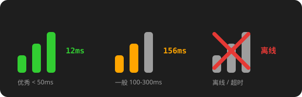

<div align="center">

# BetterNetworkStatus

更小巧的 ClassIsland 网络延迟显示组件，用信号格直观展示网络质量


</div>

---

## 效果预览



## 特性

- **紧凑信号格**：三根矩形信号条（宽 3px，总宽约 13px），底部对齐、高度递增，比纯文字组件更省空间
- **四级状态**：延迟颜色分级，一眼看出网络好坏
- **离线红叉**：断网时信号条置灰并叠加红色 X，状态一目了然
- **三种显示样式**：仅信号条 / 信号条 + 延迟数字 / 仅数字
- **三种检测模式**：ICMP（低耗）、HTTP（兼容代理）、自动降级
- **高度可配置**：延迟阈值、刷新间隔、检测目标、单色模式均可自定义

## 信号等级

| 等级 | 信号条 | 颜色 | 默认延迟范围 |
|------|--------|------|-------------|
| 优秀 | 3 格亮 | 亮绿 | < 50ms |
| 良好 | 3 格亮 | 黄绿 | 50-100ms |
| 一般 | 2 格 | 橙色 | 100-300ms |
| 较差 | 1 格 | 橙红 | > 300ms |
| 离线 | 0 格 + 红叉 | 灰色 | 超时 / 不可达 |

> 优秀与良好均为 3 格亮起，通过颜色区分；开启单色模式后信号条统一为白色，仅靠格数判断。

## 安装

1. 从 [Releases](https://github.com/yelina123/BetterNetworkStatus/releases) 下载发布包（或按下方指引自行构建）
2. **完全关闭 ClassIsland**
3. 将插件文件夹整个放入 ClassIsland 的插件目录：`<ClassIsland>/data/Plugins/BetterNetworkStatus`
4. 启动 ClassIsland，在插件页面确认状态正常
5. 在主界面编辑模式中添加「迷你网络延迟」组件

> 插件目录必须放置编译产物（dll / deps.json / manifest.yml 等），不要直接复制源代码。

## 设置项

| 设置项 | 默认值 | 说明 |
|--------|--------|------|
| 检测目标地址 | `https://www.baidu.com` | HTTP 模式的探测地址 |
| 检测模式 | 自动 | Auto（ICMP 优先，失败降级 HTTP）/ ICMP / HTTP |
| 刷新间隔 | 2 秒 | 可调 1-60 秒 |
| 显示样式 | 仅信号条 | 仅信号条 / 信号条 + 数字 / 仅数字 |
| 单色模式 | 关闭 | 信号条统一白色，不随延迟变色 |
| 优秀阈值 | 50ms | 低于该值显示为优秀 |
| 良好阈值 | 100ms | 低于该值显示为良好 |
| 较差阈值 | 300ms | 高于该值显示为较差 |

## 兼容性

| 项目 | 要求 |
|------|------|
| ClassIsland | 2.1.0.1 及以上（插件 API 2.2.0.0） |
| 运行时 | .NET 8.0（ClassIsland 内置） |
| 平台 | Windows x64 |

## 从源码构建

```bash
dotnet build -c Release
```

输出目录：`bin/Release/net8.0-windows/`，将其中全部文件复制到插件目录即可。

## 技术栈

ClassIsland.PluginSdk 2.0.0.1 · CommunityToolkit.Mvvm 8.2.1 · Avalonia 11.3

## 致谢

网络检测逻辑参考了 [SystemTools](https://github.com/Programmer-MrWang/SystemTools) 插件的 NetworkStatusComponent 实现。
